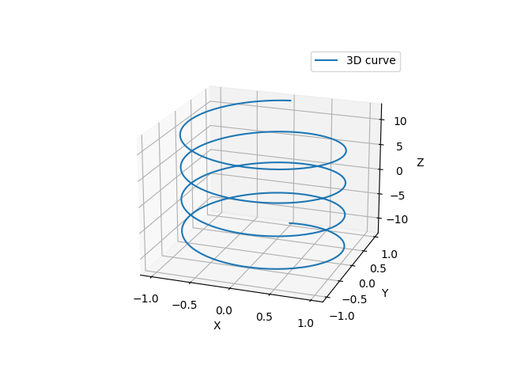
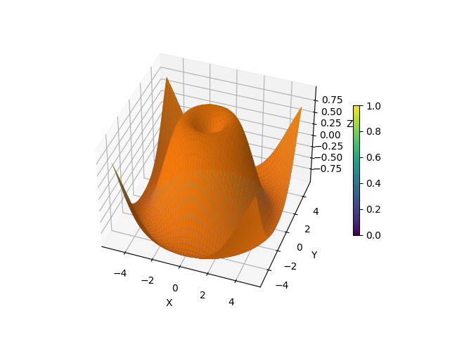

### curve.py

This script creates a figure with a 3D subplot using the Axes3D class from the mpl_toolkits.mplot3d module. It generates some data for a curve in 3D space, and plots the curve using the plot() method of the Axes3D object. It adds labels and a legend to the plot, and customizes the view angle using the view_init() method. Finally, it shows the plot using the show() method of the plt module.

You can modify this script to generate different kinds of 3D plots by changing the data and the plot settings. Have fun experimenting!

### surface.py

In this script, I've defined a scalar function of two variables f(x, y) that computes a value based on the input variables x and y. I've then generated a set of input points for x and y using np.linspace(), and used np.meshgrid() to create a 2D grid of input points X and Y. I've evaluated the function f() on this grid of input points to get a 2D array Z of function values.

I've then created a 3D surface plot using the plot_surface() method of the Axes3D object, using the input arrays X, Y, and Z. I've used the cmap parameter to specify the colormap to use for the surface. I've added labels and a colorbar to the plot using the set_xlabel(), set_ylabel(), set_zlabel(), and colorbar() methods. Finally, I've customized the view angle using the view_init() method.

You can modify the function f(x, y) to plot a different scalar function of two variables, and experiment with different input points and plot settings to create your own cool 3D surface plots.